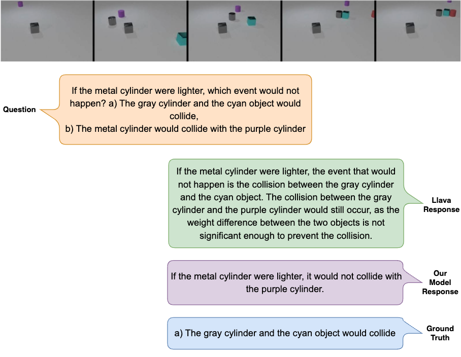

# Leveraging VLMs and LLMs for Commonsense Reasoning in Visual Scenes

This work is the final project for CSCI 535: Multimodal Probabilistic Learning of Human Communication at the University of Southern California.

This research project aims to advance AI capabilities by leveraging Vision Language Models (VLMs) and Large Language Models (LLMs) to enhance commonsense reasoning within visual contexts. The approach integrates a vision encoder with architectures for temporal and spatial modeling to deepen AI's comprehension and interaction with visual data, particularly videos.

## Dataset

The project utilizes the [Compositional Physical Reasoning (ComPhy) dataset](https://comphyreasoning.github.io/), which focuses on testing reasoning abilities in understanding how objects interact under various physical conditions. The dataset includes annotations for hidden physical properties, diverse interaction scenarios, and an evaluation framework for assessing models' ability to discern and utilize hidden physical properties.

## Model Training

1. **Pretraining Slot Attention**
  - Used CLIP (ViT-L/14) to extract video features from the ActivityNet dataset.
  - Employed the same technique as Dinosaur, where the module reconstructs the ViT features from the generated slots.
  - Pretrained the spatial slot attention module on the [CLEVRER dataset](http://clevrer.csail.mit.edu/).

2. **Instruction Tuning**
  - Performed instruction tuning using the Video Instruction Data curated by the authors of [Video-ChatGPT](https://github.com/mbzuai-oryx/Video-ChatGPT/tree/main).
  - The dataset comprises approximately 100,000 video-text pairs from the ActivityNet dataset.

3. **Fine-tuning on ComPhy**
  - Fine-tuned the model on the Compositional Physical Reasoning (ComPhy) dataset.
  - ComPhy focuses on testing reasoning abilities in understanding object interactions under various physical conditions.

All training was performed on 2 Nvidia A100 80GB GPUs.
## Model Inference
